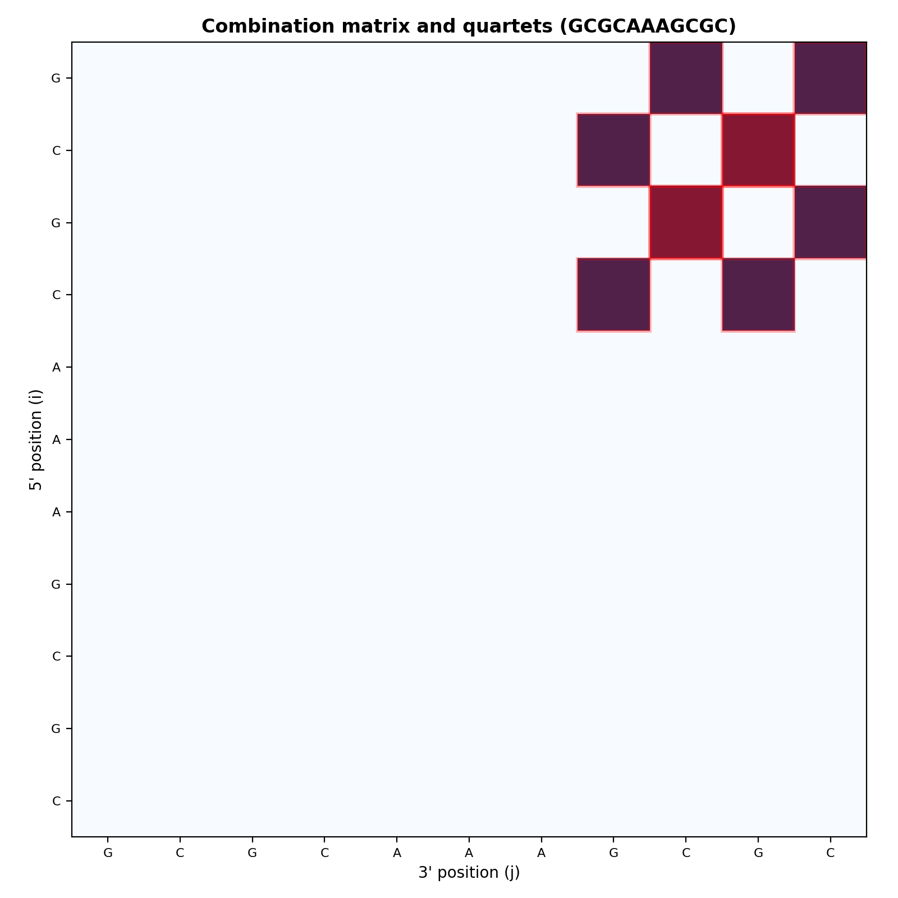
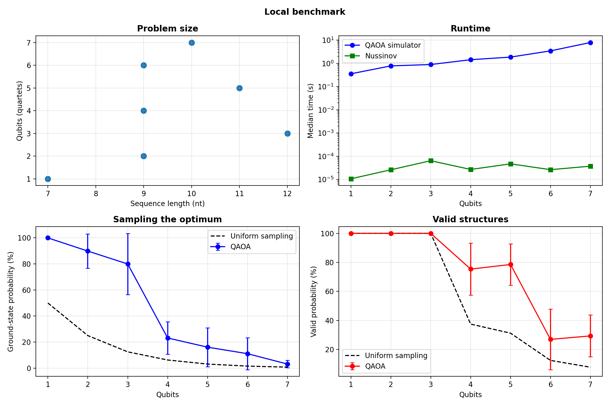
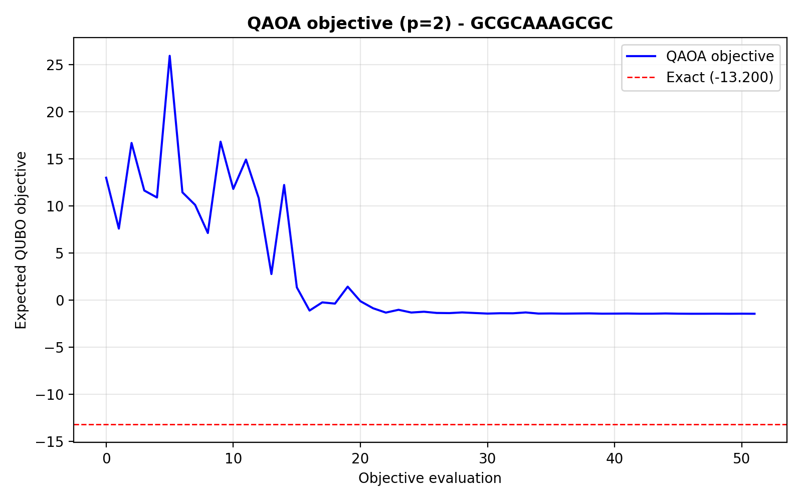
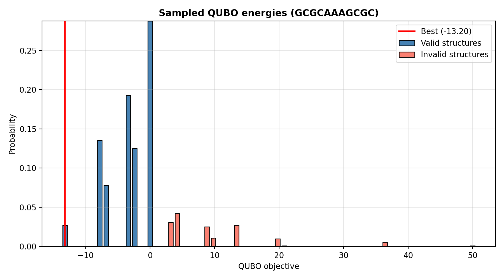
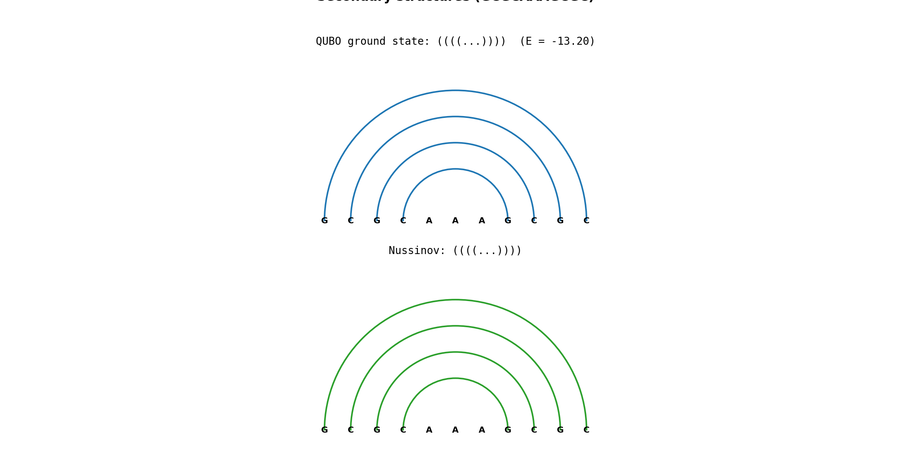

# mRNA Folding with Quantum Computing

GenQ Hackathon project exploring mRNA secondary structure prediction with QAOA and a quartet-based QUBO model.

Built during the **GenQ Hackathon** (Microsoft, IonQ, Moderna), October 17-19, 2025 in Geneva. The pipeline was connected to IonQ Aria through [QCentroid](https://qcentroid.xyz) during the event. Those hardware jobs were not saved, so all numbers reported here come from new local simulator runs.

More context about the event and the team is in [my LinkedIn post](https://www.linkedin.com/posts/mikita-mizerkin_notgptgenerated-genq-lifesciences-activity-7387133438954295297-C0lC).

## What it does

The input is an RNA sequence containing A, U, G and C. Classical preprocessing finds possible stacked base-pair quartets, their Turner 2004 energies and pairs of quartets which cannot coexist. Each quartet becomes one binary variable in a QUBO:

$$
\min_q \sum_i e_i q_i + r \sum_{(i,j) \in QS} q_iq_j + \lambda \sum_{(i,j) \in QC} q_iq_j
$$

Here $r=-2$ rewards a longer continuous stem and $\lambda=10$ penalizes partner conflicts and pseudoknots. QAOA samples bitstrings from this model. Postprocessing turns them into dot-bracket structures and rejects invalid ones.

The QUBO objective is a simplified model score. It contains Turner stacking energies together with two manually chosen coefficients, so it should not be read as a complete folding free energy in kcal/mol.

```text
sequence -> quartets -> QUBO -> QAOA samples -> validation -> dot-bracket
```



## Running locally

Python 3.10 or newer is recommended.

```bash
python -m venv .venv
source .venv/bin/activate
pip install -r requirements.txt

python app.py --sequence GCGCAAAGCGC --reps 2
python app.py --all
```

ViennaRNA and the old cloud integrations are optional:

```bash
pip install -r requirements-vienna.txt
pip install -r requirements-cloud.txt
```

No IonQ or QCentroid account is needed for the local CLI or benchmark.

## Local benchmark

The benchmark uses seven small sequences requiring 1-7 qubits. For each sequence it runs QAOA with $p=2$, 4096 shots and five seeds (42-46). It compares the sampled distribution with the exact QUBO optimum and with uniform random sampling over the same bitstrings.

| Sequence | Qubits | Exact objective | Mean E[QAOA] | P(optimum) | Uniform P(optimum) | P(valid) |
|---|---:|---:|---:|---:|---:|---:|
| `GCAAAGC` | 1 | -3.40 | -3.40 | 100.0% | 50.0% | 100.0% |
| `GUCAAAGAU` | 2 | -5.80 | -5.41 | 89.9% | 25.0% | 100.0% |
| `GGCCAAAUGGCC` | 3 | -14.00 | -11.87 | 80.0% | 12.5% | 100.0% |
| `CUUUAUGAG` | 4 | -5.40 | 1.50 | 23.2% | 6.2% | 75.4% |
| `GCGCAAAGCGC` | 5 | -13.20 | -1.65 | 16.1% | 3.1% | 78.5% |
| `AGAAUCUUU` | 6 | -3.90 | 15.25 | 11.1% | 1.6% | 27.0% |
| `UUUGCGAAGG` | 7 | -3.50 | 19.04 | 3.1% | 0.8% | 29.4% |

`Mean E[QAOA]` is the expected QUBO objective over the complete sampled distribution. `P(optimum)` is the probability assigned to all exact ground states.

The small cases work well, but the distribution becomes much less concentrated as more competing quartets are added. QAOA gives a higher mean probability of the optimum than uniform sampling for every sequence in this set, although the variance between seeds is large. At seven qubits the optimum has only 3.1% mean probability and less than a third of the sampled probability belongs to valid structures.

The best sampled bitstring reached the exact optimum in all five runs. That result is easy to overstate: 4096 shots are enough to observe low-probability states in these tiny search spaces. The probability and expected objective are more useful metrics than the best sample alone.

The exact QUBO structures have base-pair F1 = 1.0 against Nussinov for this selected toy set. This is agreement between two simplified models, not a biological accuracy result.



The convergence plot below shows one representative five-qubit run. COBYLA improves the expected objective, but it stays well above the exact ground state. The second plot uses the complete normalized sample distribution and separates valid and invalid structures.

<p align="center">
  
  
</p>

For the same sequence, the exact QUBO and Nussinov structures agree:



To reproduce the table, JSON data and figures:

```bash
python benchmark.py --runs 5 --plot
```

[`benchmark_results.json`](benchmark_results.json) contains the environment, solver settings, aggregate values and each individual run. ViennaRNA fields are `null` in the checked-in run because its optional Python package was not available in this environment.

## Limitations

- The benchmark contains seven hand-picked toy sequences and at most seven qubits.
- The energy model includes quartet stacking, a stem reward and conflict penalties, but not the full loop and terminal energy model used by ViennaRNA.
- Pseudoknots are rejected during postprocessing.
- The local statevector simulation is useful for checking the formulation, not for demonstrating a quantum speedup.
- The old IonQ run cannot be compared with the local results because its raw output was not retained.

## Project structure

```text
qcentroid.py                 old QCentroid entry point
app.py                       local CLI
benchmark.py                 reproducible local benchmark
benchmark_results.json       saved benchmark data
figures/                     generated plots
mrna_qfold/
  preprocessing.py           sequence -> quartets and conflicts
  energy_params.py           Turner 2004 stacking parameters
  qubo.py                    QUBO construction
  quantum_solver.py          QAOA and exact solver
  postprocessing.py          validation and dot-bracket decoding
  classical_baseline.py      Nussinov and optional ViennaRNA
  visualization.py           benchmark plots
tests/
```

Run the tests with:

```bash
pytest -q
```

## References

- Zaborniak et al. (2022), [A QUBO model of the RNA folding problem optimized by variational hybrid quantum annealing](https://arxiv.org/abs/2208.04367)
- Alevras et al. (2024), [mRNA secondary structure prediction using utility-scale quantum computers](https://arxiv.org/abs/2405.20328)
- Mathews et al. (2004), [Turner 2004 nearest-neighbor parameters](https://rna.urmc.rochester.edu/NNDB/)
